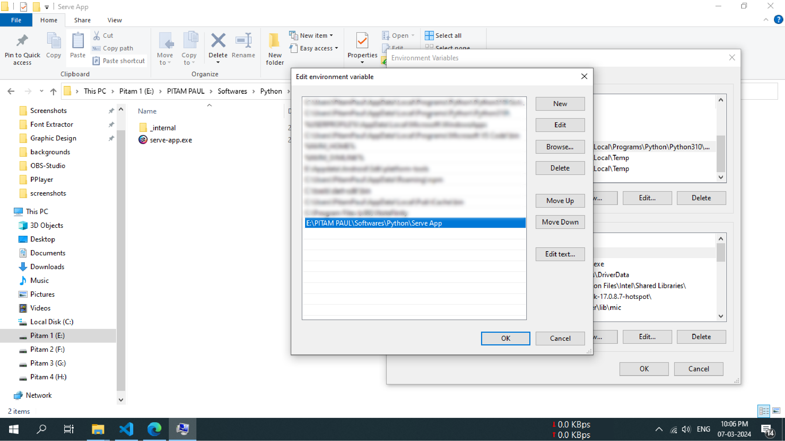

# Serve App
> A simple command line tool made with Python Flask to Serve your production ready React or Vue App

## How it works
<video src="https://github.com/pritambeta/Serve-App/assets/83262358/b5b13a8c-85af-4af6-8985-38f7f24fb751" controls>
Your browser does not support the video tag.
</video>

## Installation
To install the release version of the tool, follow these steps:
1. Go to the [Releases](https://github.com/pritambeta/Serve-App/releases) page of the repository.
2. Download the latest release

 package to a directory of your choice.
3. Extract the zip file.
4. Open the `Environment Variables` settings and paste the path of the folder into the designated field there.

5. Navigate to any build version of a React or Vue app.
6. Open Powershell at that location and execute `serve-app`.
7. Boom 💥! Your application is now running on a specific port on your system.
